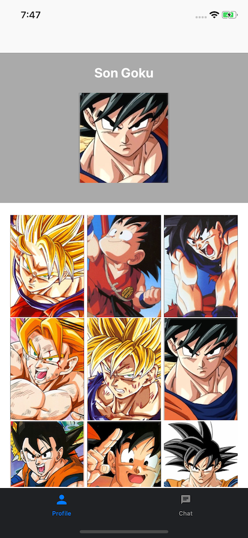

# Rekd iOS Coding Challenge README
Welcome to the Rekd Technical interview.

Use this repo to recreate the below designs.

(Screen 1a)

-

(Screen 1b)

-

(Screen 2)

Your interviewer will give you instructions on how to approach the challenge. You will have 45 minutes to get through it all.

## Good luck!

